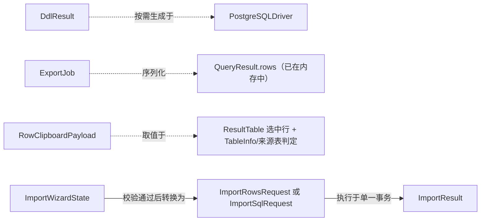

# Data Model: 工作台效率工具集（导出/DDL/格式化/复制/导入）

**Feature**: `006-workbench-productivity-tools` | **Date**: 2026-08-13

本功能不新增持久化数据库表（不涉及应用自身的配置存储改动），以下实体均为主进程 ↔ 渲染进程之间通过 IPC 传递的瞬时数据结构（TypeScript 类型），生命周期限于单次操作。字段设计直接对应 spec.md 的 Key Entities 与相关 Functional Requirements。

## 1. DDL 结果（对应 spec.md「DDL 结果」）

用途：查看表/视图 DDL（User Story 1，FR-001~FR-005）的返回结构。

```typescript
interface DdlResult {
  objectType: 'table' | 'view'
  schema: string
  name: string
  ddl: string // 完整 DDL 文本，可直接复制
}
```

- `ddl` 生成规则见 research.md §5；表的 `ddl` 包含列定义、约束、索引（多条语句以 `\n\n` 分隔：`CREATE TABLE` 主体 + 若干 `CREATE INDEX`）；视图的 `ddl` 为单条 `CREATE OR REPLACE VIEW ... AS ...`。
- 校验规则：`schema`/`name` 非空；`ddl` 为空字符串视为异常（FR-005 场景，应改为抛出错误而非返回空 `DdlResult`）。
- 错误路径不通过此结构表达，而是 IPC 调用抛出的标准错误（见 contracts/db-ipc-productivity.md 的错误契约）。

## 2. 导出任务（对应 spec.md「导出任务」）

用途：导出查询结果为 CSV/JSON（User Story 2，FR-006~FR-011）。此实体完全存在于渲染进程内存中（组件本地 state），不通过 IPC 结构化传递（IPC 层只有"选择保存路径"与"写文件"两个原子调用），因此以渲染进程类型定义为准：

```typescript
interface ExportJob {
  format: 'csv' | 'json'
  filePath: string // 来自 fs:pick-save-file 的返回值
  rowCount: number // 导出前已知的结果集行数（QueryResult.rowCount）
  status: 'preparing' | 'writing' | 'done' | 'error'
  errorMessage?: string
}
```

- `status` 驱动 FR-010 要求的"进行中"状态反馈（例如按钮 loading / toast），不持久化、不跨会话保留。
- 序列化规则：CSV 沿用 research.md §3 的转义规则；JSON 为 `JSON.stringify(rows, null, 2)`，`null` 字段渲染为 JSON `null`（非字符串）。
- 0 行结果集：CSV 仍写出表头行；JSON 写出 `[]`。

## 3. 行剪贴板负载（对应 spec.md「行剪贴板负载」）

用途：复制选中行为 INSERT/JSON/CSV（User Story 3，FR-012~FR-016）。纯渲染进程内计算，不经过 IPC（剪贴板写入使用 Web `navigator.clipboard.writeText`，不需要主进程参与）。

```typescript
interface RowClipboardPayload {
  format: 'insert' | 'json' | 'csv'
  sourceTable: { schema: string; name: string } | null // null 表示来源表不可确定
  rowCount: number
  text: string // 最终写入剪贴板的文本
}
```

- `sourceTable` 的确定规则：
  - 在 `DataBrowser.tsx` 场景（单表浏览）中始终可确定，取当前 `state.schema`/`state.table`。
  - 在 `QueryPanel.tsx` 场景（任意 SQL 结果）中默认视为不可确定（`null`），除非未来扩展了列到表的来源追踪（本功能范围不含该追踪能力，直接采用占位符表名，对应 FR-015 的第二种情形）。
- `format = 'insert'` 且 `sourceTable === null` 时，`text` 中的表名使用占位符 `"<table_name>"`（保持合法 SQL 标识符外观但明显需要用户替换）。
- 值的转义规则（FR-014）：字符串/日期类型加单引号并转义内部单引号（`'` → `''`）；数值/布尔不加引号；`null`/`undefined` 渲染为裸 `NULL` 关键字（不加引号）；无法安全序列化的二进制/超长值（Edge Case）转义为字符串形式并追加说明性后缀（不尝试原样还原二进制）。

## 4. 导入任务（对应 spec.md「导入任务」）

用途：导入 CSV/JSON/SQL 文件到表（User Story 5，FR-022~FR-027）。分为渲染进程侧的向导状态与主进程侧的执行请求/响应两部分。

### 4.1 渲染进程侧：导入向导状态

```typescript
interface ImportWizardState {
  sourceFile: {
    path: string
    format: 'csv' | 'json' | 'sql'
    encoding: 'utf-8' // 见 research.md 与 Edge Cases：非 UTF-8 编码文件直接报错，不做转码
  }
  targetTable: { schema: string; name: string } // 用户已选择的已存在目标表
  columnMapping?: ColumnMapping[] // 仅 csv/json 需要；sql 文件不适用
  previewRows: Record<string, unknown>[] // 解析后用于预览的前 N 行（不代表全部待导入数据）
  status: 'selecting-file' | 'mapping-columns' | 'confirming' | 'importing' | 'done' | 'error'
}

interface ColumnMapping {
  sourceField: string // 文件中的字段名/列名
  targetColumn: string | null // 目标表列名；null 表示未映射
  required: boolean // 来自目标表列的 nullable/是否有默认值判断
}
```

- 校验规则（FR-023）：任意 `required = true` 且 `targetColumn === null` 的映射项存在时，禁止进入 `confirming` 状态。
- 校验规则（FR-027）：`sourceFile` 解析结果为空（CSV 无数据行 / JSON 空数组 / SQL 文件拆分后无语句）时，禁止进入 `confirming` 状态，直接停留在 `selecting-file` 并提示。

### 4.2 主进程侧：事务性导入执行请求/响应

对应 research.md §6 新增的 `IDatabaseDriver.importRows` 方法与 IPC 通道：

```typescript
// 请求（CSV/JSON 场景）
interface ImportRowsRequest {
  schema: string
  table: string
  columns: string[] // 已按 ColumnMapping 解析为目标列名，顺序与 rows 中每行的值顺序一致
  rows: unknown[][] // 每个子数组是一行的值，顺序对应 columns
}

// 请求（SQL 文件场景）
interface ImportSqlRequest {
  statements: string[] // 已用 research.md §2 的拆分函数拆分好的语句数组
}

// 响应（两种请求共用）
interface ImportResult {
  succeededCount: number
  failedAt?: {
    index: number // 失败的行号（0-based，CSV/JSON 场景）或语句序号（SQL 场景）
    message: string // 数据库返回的原始错误信息
  }
  rolledBack: boolean // 恒为 true（失败必回滚）；成功时不存在 failedAt 且 rolledBack 为 false
}
```

- 状态转移：`ImportRowsRequest`/`ImportSqlRequest` → 主进程内 `BEGIN` → 逐行/逐语句执行 → 全部成功 `COMMIT`（`succeededCount = 总数`，无 `failedAt`）或首次失败 `ROLLBACK`（`succeededCount = 0`，因为事务已回滚，落地行数为 0；`failedAt` 记录失败位置）。
- 该响应结构同时满足 FR-025（报告失败位置和原因、回滚）与 FR-026（展示成功数/失败摘要）。

## 5. 实体关系图



无新增持久化实体，本功能不涉及数据库 schema 迁移。
