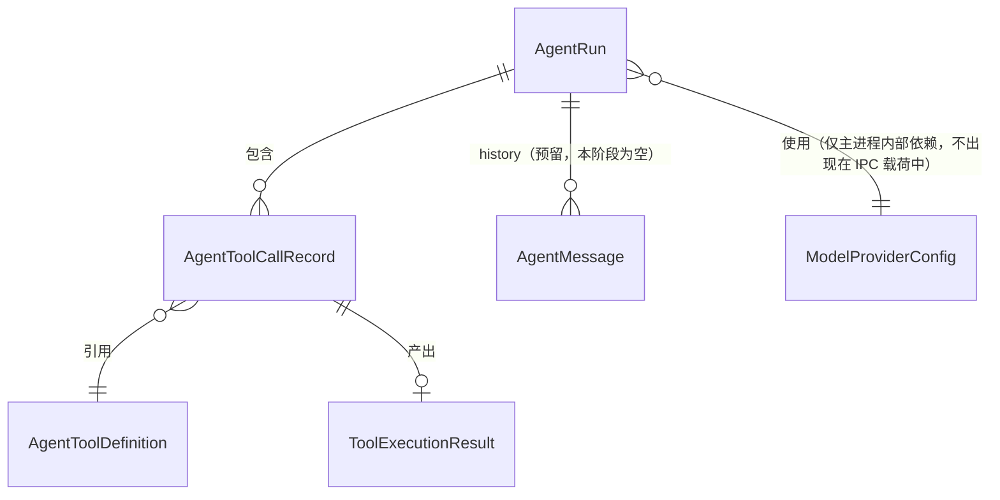

# Data Model: Code 模式 Agent 化改造

本文件定义本功能引入的核心数据结构。除特殊说明外，所有结构均为 TypeScript 接口，供主进程（`src/main/ai/`）与渲染进程（`src/renderer/src/types/agent.ts`）共享（渲染进程侧仅保留展示所需字段，见各实体的"渲染进程可见性"说明）。

## 1. AgentToolDefinition（工具定义）

对应 spec.md 的"工具定义"实体，落地 FR-002。

| 字段          | 类型                                                       | 说明                                                                                |
| ------------- | ---------------------------------------------------------- | ----------------------------------------------------------------------------------- |
| `name`        | `string`                                                   | 全局唯一，`模块.动作` 格式，如 `schema.listTables`、`sql.executeWrite`              |
| `description` | `string`                                                   | 面向模型的自然语言功能描述，用于 function-calling 的 `description` 字段             |
| `mutates`     | `boolean`                                                  | 是否为"修改类"工具；`true` 时触发 FR-014 的执行前确认流程                           |
| `inputSchema` | `z.ZodType`                                                | 输入参数的 zod schema，运行时校验与 JSON Schema 派生的唯一来源（见 research.md §4） |
| `execute`     | `(input: TInput) => Promise<ToolExecutionResult<TOutput>>` | 工具的实际执行函数，内部委托给 `driverManager` 或纯函数（如 `sql-formatter`）       |

**渲染进程可见性**：渲染进程不直接持有 `execute`；`agent:list-tools` 返回的是派生出的只读展示形态 `{ name, description, mutates, inputJsonSchema }`。

**校验规则**：

- `name` 必须匹配 `^[a-z]+\.[a-zA-Z]+$`，注册时重复的 `name` 视为配置错误（启动期抛出，不进入运行期）。
- `inputSchema` 校验失败时，`execute` 不会被调用，直接返回 FR-013 要求的逐字段错误（见下文 `ToolExecutionResult`）。

## 2. ToolExecutionResult（工具输出格式）

标准化的工具输出结构，对应 FR-002"标准化输出格式"。

```typescript
type ToolExecutionResult<TOutput> =
  | { status: 'success'; data: TOutput }
  | { status: 'error'; error: { message: string; fieldErrors?: Record<string, string> } }
```

- `fieldErrors` 仅在输入参数校验失败时出现（FR-013），键为字段名、值为该字段的错误说明。
- 工具执行期间抛出的异常（如数据库连接失败）在 `registry.invoke()` 层统一捕获并转换为 `{ status: 'error', error: { message } }`，不会让异常穿透到 Agent 循环之外。

## 3. AgentToolCallRecord（工具调用记录）

对应 spec.md"工具调用记录"实体，落地 FR-010。

| 字段                       | 类型                                                      | 说明                                                                                        |
| -------------------------- | --------------------------------------------------------- | ------------------------------------------------------------------------------------------- |
| `id`                       | `string`                                                  | 调用记录唯一标识（同一 `AgentRun` 内自增或 uuid）                                           |
| `toolName`                 | `string`                                                  | 对应 `AgentToolDefinition.name`                                                             |
| `input`                    | `unknown`                                                 | 实际传入的参数（校验通过后的值）                                                            |
| `mutates`                  | `boolean`                                                 | 快照自工具定义，避免展示层重复查表                                                          |
| `confirmation`             | `'not_required' \| 'pending' \| 'approved' \| 'rejected'` | 仅 `mutates=true` 的记录会经历 `pending → approved/rejected`；只读工具固定为 `not_required` |
| `result`                   | `ToolExecutionResult<unknown> \| null`                    | 调用完成前为 `null`；`confirmation` 为 `rejected` 时保持 `null` 并进入下一步推理            |
| `startedAt` / `finishedAt` | `number \| null`                                          | 时间戳（毫秒），用于展示耗时；`finishedAt` 在 `rejected` 时不设置                           |

**渲染进程可见性**：整个结构对渲染进程可见（用于 FR-010 的调用轨迹展示），但 `input`/`result.data` 中若包含大体量数据（如宽表列信息），展示层自行截断，不在数据结构层面限制。

## 4. AgentRun（Agent 运行状态机）

对应 spec.md"对话会话"实体在单次执行期间的具体状态，是本功能状态管理的核心。

| 字段                  | 类型                                                | 说明                                                                                                                               |
| --------------------- | --------------------------------------------------- | ---------------------------------------------------------------------------------------------------------------------------------- |
| `id`                  | `string`                                            | `AgentRun` 唯一标识（`runId`），IPC 请求/响应与确认操作均以此关联                                                                  |
| `status`              | `AgentRunStatus`                                    | 见下方状态机                                                                                                                       |
| `instruction`         | `string`                                            | 用户提交的原始自然语言指令                                                                                                         |
| `history`             | `AgentMessage[]`                                    | 本次运行使用的历史消息；本阶段调用方始终传入 `[]`（多轮对话预留字段，见 research.md §10）                                          |
| `iterationCount`      | `number`                                            | 已完成的"思考-行动"轮次，用于对照 `maxIterations`（research.md §6）                                                                |
| `toolCalls`           | `AgentToolCallRecord[]`                             | 本次运行产生的全部工具调用记录，按发生顺序追加                                                                                     |
| `pendingConfirmation` | `{ toolCallId: string; summary: string } \| null`   | `status === 'paused_for_confirmation'` 时必填；`summary` 是面向用户的自然语言描述（"即将对表 X 执行 DELETE，影响约 N 行"这类文案） |
| `finalMessage`        | `string \| null`                                    | 循环结束（`completed`/`failed`）后的最终回复文本                                                                                   |
| `error`               | `{ code: AgentErrorCode; message: string } \| null` | `status === 'failed'` 时的结构化错误（见下方错误码）                                                                               |

### 状态机（`AgentRunStatus`）

```text
running ──(选中修改类工具)──> paused_for_confirmation
paused_for_confirmation ──(用户确认 approved)──> running
paused_for_confirmation ──(用户拒绝 rejected)──> running   # 拒绝也回到 running，让循环据此继续推理，而非直接终止
running ──(模型给出最终答案)──> completed
running ──(达到 maxIterations 仍无最终答案)──> failed（error.code = 'max_iterations_exceeded'）
running ──(模型调用失败：超时/限流/鉴权失败等)──> failed
running ──(密钥未配置)──> failed（error.code = 'provider_not_configured'，在第一次思考前即可判定）
```

`paused_for_confirmation` 是本状态机中唯一的"中断-恢复"节点，对应 research.md §8 的设计；除此之外没有其它可暂停的状态，保证 FR-005 的单轮约束不被破坏。

### AgentErrorCode

`'provider_not_configured' | 'provider_auth_failed' | 'provider_rate_limited' | 'provider_timeout' | 'provider_unavailable' | 'max_iterations_exceeded'`

对应 research.md §7 的四类模型调用错误 + §6 的轮次上限错误。

**渲染进程可见性**：`AgentRun` 整体是 `agent:chat` 的响应载体；渲染进程侧的 `AgentRunStatus`（`src/renderer/src/types/agent.ts`）省略 `history`（多轮对话预留字段，当前阶段无展示价值）。

## 5. AgentMessage（消息，多轮对话预留结构）

对应 spec.md"消息"实体。本阶段仅用于 `AgentRun.history` 的类型占位（始终为空数组），为未来多轮对话预留。

| 字段        | 类型                    | 说明                                                                               |
| ----------- | ----------------------- | ---------------------------------------------------------------------------------- |
| `role`      | `'user' \| 'assistant'` | 消息发出方；本阶段的会话展示直接由 `AgentRun` 派生，不单独渲染 `AgentMessage` 列表 |
| `content`   | `string`                | 消息文本内容                                                                       |
| `toolCalls` | `AgentToolCallRecord[]` | 若该消息是 Agent 回复且包含工具调用，记录于此（多轮对话上线后用于重建上下文）      |
| `createdAt` | `number`                | 时间戳（毫秒）                                                                     |

## 6. ModelProviderConfig（模型提供方配置）

对应 spec.md"模型提供方配置"实体，落地 FR-007/FR-008。**仅存在于主进程**，任何字段不通过 IPC 传递给渲染进程。

| 字段               | 类型             | 说明                                                             |
| ------------------ | ---------------- | ---------------------------------------------------------------- |
| `provider`         | `'deepseek'`     | 当前阶段固定值；`IModelProvider` 的实现标识                      |
| `apiKey`           | `string \| null` | 来自 `process.env.DEEPSEEK_API_KEY`；`null` 表示未配置           |
| `baseURL`          | `string`         | 默认 `https://api.deepseek.com`，可通过 `DEEPSEEK_BASE_URL` 覆盖 |
| `model`            | `string`         | 默认 `deepseek-chat`，可通过 `DEEPSEEK_MODEL` 覆盖               |
| `maxIterations`    | `number`         | 默认 `8`，可通过 `AGENT_MAX_ITERATIONS` 覆盖                     |
| `requestTimeoutMs` | `number`         | 默认 `60000`，可通过 `AGENT_REQUEST_TIMEOUT_MS` 覆盖             |

渲染进程仅能通过 `agent:chat`/`agent:list-tools` 等调用间接感知"是否已配置"（即 `AgentErrorCode = 'provider_not_configured'` 是否出现），不会读到 `apiKey` 本身。

## 实体关系图


