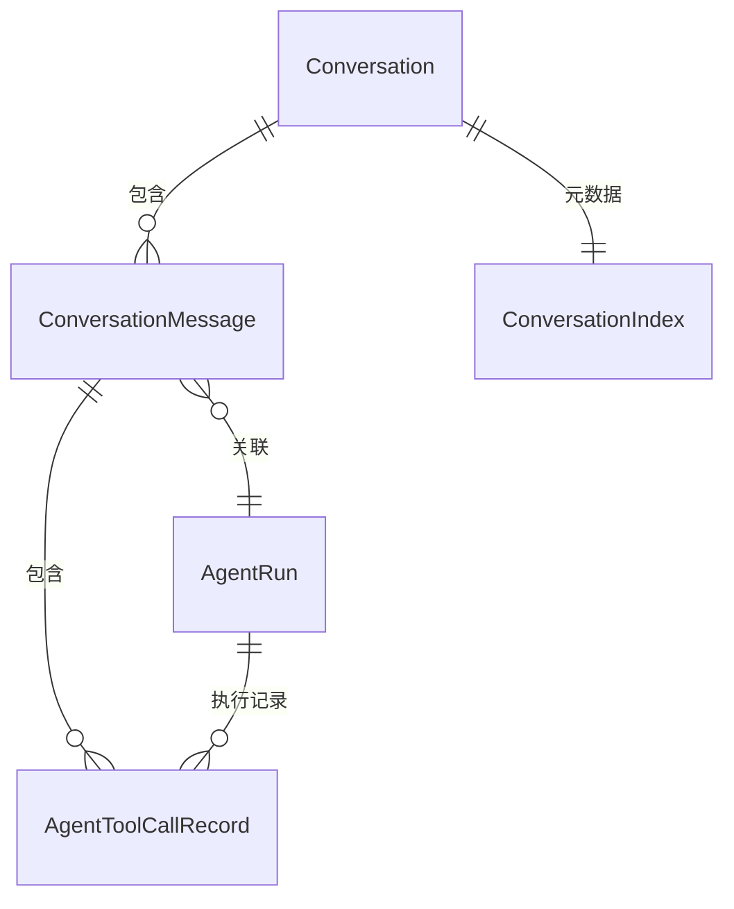

# Data Model: AI Agent 多轮对话与本地记忆化存储

本文件定义本功能引入和扩展的核心数据结构。所有结构均为 TypeScript 接口，供主进程（`src/main/`）与渲染进程（`src/renderer/src/`）共享。
008 号功能的既有类型（`AgentRun`、`AgentToolCallRecord`、`ToolExecutionResult`、`AgentMessage`）保持不变，本功能在其基础上新增对话管理层。

## 1. Conversation（对话）

对应 spec.md"对话"实体。一条对话是用户与 Agent 之间多轮交互的容器。

| 字段           | 类型                     | 说明                                                |
| -------------- | ------------------------ | --------------------------------------------------- |
| `id`           | `string`                 | UUID，创建时由主进程生成                            |
| `title`        | `string`                 | 自动生成的标题（首条用户指令截取前 50 字符）        |
| `status`       | `'active' \| 'archived'` | 活跃 / 已归档；归档不影响数据存储，仅控制面板可见性 |
| `createdAt`    | `number`                 | 创建时间戳（毫秒）                                  |
| `updatedAt`    | `number`                 | 最后更新时间戳（毫秒），每轮新消息后更新            |
| `messageCount` | `number`                 | 消息总数（去重后的 turn 计数），用于列表展示和分页  |

**状态转换**:

```
[创建] → active ←→ archived（手动右键切换）
active → [删除]（永久移除）
archived → [删除]（永久移除）
```

**存储位置**: 仅元数据（以上字段）存入 electron-store 的 `conversations` key（数组）。消息正文见 §2。

**渲染进程可见性**: 全部字段可见，用于对话列表渲染。

## 2. ConversationMessage（对话消息）

对应 spec.md"消息"实体。一条消息 = 一轮用户指令 + Agent 运行结果。直接复用 008 号功能的 `AgentMessage` 类型并扩充。

| 字段             | 类型                                                | 说明                                                        |
| ---------------- | --------------------------------------------------- | ----------------------------------------------------------- |
| `id`             | `string`                                            | 消息 UUID                                                   |
| `conversationId` | `string`                                            | 所属对话 ID                                                 |
| `role`           | `'user' \| 'assistant'`                             | 消息发出方                                                  |
| `instruction`    | `string`                                            | 用户原始指令（仅 `role === 'user'` 时有值）                 |
| `content`        | `string`                                            | Agent 最终回复文本（仅 `role === 'assistant'` 时有值）      |
| `toolCalls`      | `AgentToolCallRecord[]`                             | 本轮产生的工具调用记录（复用 008 类型）                     |
| `runId`          | `string \| null`                                    | 关联的 AgentRun ID（用于切换恢复），完成/失败后置 null      |
| `runStatus`      | `AgentRunStatus \| null`                            | AgentRun 的最终状态（completed/failed），进行中时为当前状态 |
| `error`          | `{ code: AgentErrorCode; message: string } \| null` | 失败时的错误信息                                            |
| `sequence`       | `number`                                            | 对话内的序号，自 0 递增，严格连续                           |
| `createdAt`      | `number`                                            | 时间戳（毫秒）                                              |

**存储位置**: 以 JSONL 格式存入 `conversations/{conversationId}.jsonl`，每行一条消息的 JSON 序列化。

**渲染进程可见性**: 全部字段可见。

## 3. ConversationIndex（对话索引）

对应 spec.md"对话元数据索引"实体。electron-store 中持久化的轻量级对话列表。

| 字段            | 类型             | 说明                                            |
| --------------- | ---------------- | ----------------------------------------------- |
| `conversations` | `Conversation[]` | 所有对话元数据的数组，始终保持与 JSONL 文件同步 |

**存储位置**: electron-store 的 `conversations` key（自动原子写入）。

**索引重建**: 启动时如果索引文件损坏，遍历 `conversations/` 目录下的 JSONL 文件，从文件元数据（首行/末行时间戳）重建索引。

## 4. AgentRun 扩展（主进程内部）

对 008 号功能 `AgentRun`（`src/main/ai/loop/AgentRun.ts`）的扩展。

| 新增/变更字段    | 类型                 | 说明                                                     |
| ---------------- | -------------------- | -------------------------------------------------------- |
| `conversationId` | `string`             | 关联的对话 ID，创建时绑定                                |
| ~~`history`~~    | ~~`AgentMessage[]`~~ | **升级为实际使用**：不再始终为空，而是加载对话历史后填充 |

**行为变更**:

- `createAgentRun()`: 新增 `conversationId` 参数
- `startRun()`: 接受 `historyMessages: ChatMessage[]`（从 ConversationMessage 转换而来的 LLM 格式历史），插入到 system prompt 之后、当前用户指令之前

## 5. IPC 通道负载类型

### `conversation:list` 返回

```typescript
// 直接返回 Conversation[]，即对话索引的全量元数据列表
type ConversationListResponse = Conversation[]
```

### `conversation:get` 请求/返回

```typescript
interface ConversationGetRequest {
  conversationId: string
  offset?: number // 消息序号偏移，默认 0（从最早开始）
  limit?: number // 返回条数，默认 50
}

interface ConversationGetResponse {
  conversation: Conversation
  messages: ConversationMessage[]
  total: number // 该对话消息总数
}
```

### `conversation:create` 返回

```typescript
// 返回新创建的对话元数据
type ConversationCreateResponse = Conversation
```

### `conversation:delete` / `conversation:archive` 请求

```typescript
interface ConversationActionRequest {
  conversationId: string
}
```

### `agent:chat` 请求扩展

```typescript
// 在 008 号功能基础上扩展
interface AgentChatRequest {
  instruction: string
  connectionId: string | null
  database: string | null
  conversationId?: string // 新增：指定对话 ID，不传则自动创建新对话
}
```

## 实体关系图



## 与 008 号功能数据模型的差异摘要

| 变更项                           | 说明                                                                               |
| -------------------------------- | ---------------------------------------------------------------------------------- |
| 新增 `Conversation`              | 对话容器实体，管理多轮交互的生命周期                                               |
| 扩展 `ConversationMessage`       | 基于 `AgentMessage` 扩充，新增 `instruction`/`runId`/`runStatus`/`sequence` 等字段 |
| 新增 `ConversationIndex`         | 轻量级元数据索引，与消息正文分离存储                                               |
| `AgentRun` 扩展                  | `history` 从预留占位升级为实际使用，新增 `conversationId`                          |
| `AgentChatRequest` 扩展          | 新增 `conversationId` 可选字段                                                     |
| 新增 `conversation:*` IPC 通道族 | 6 个新通道                                                                         |
